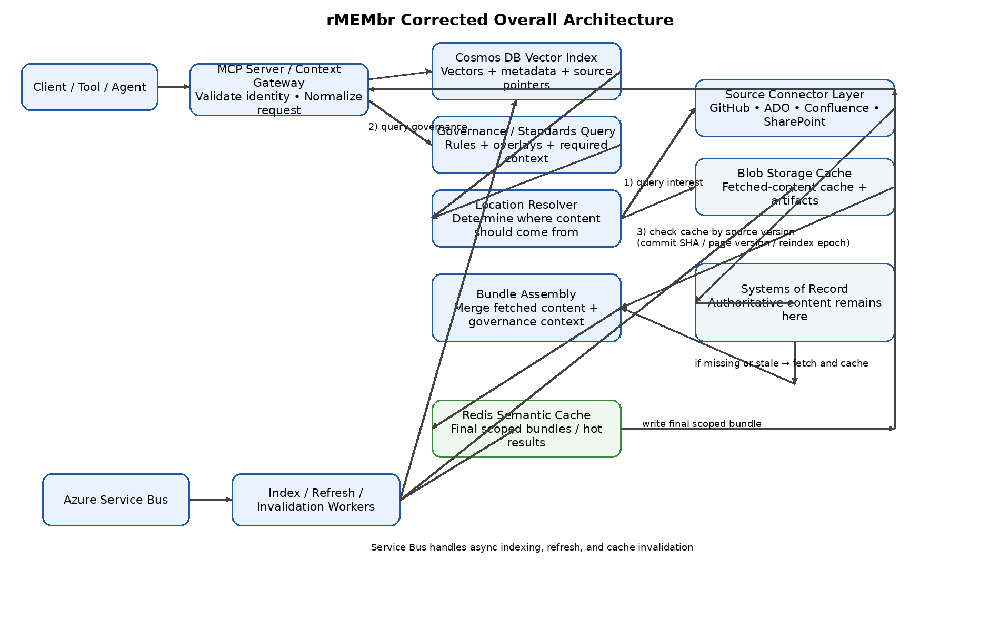
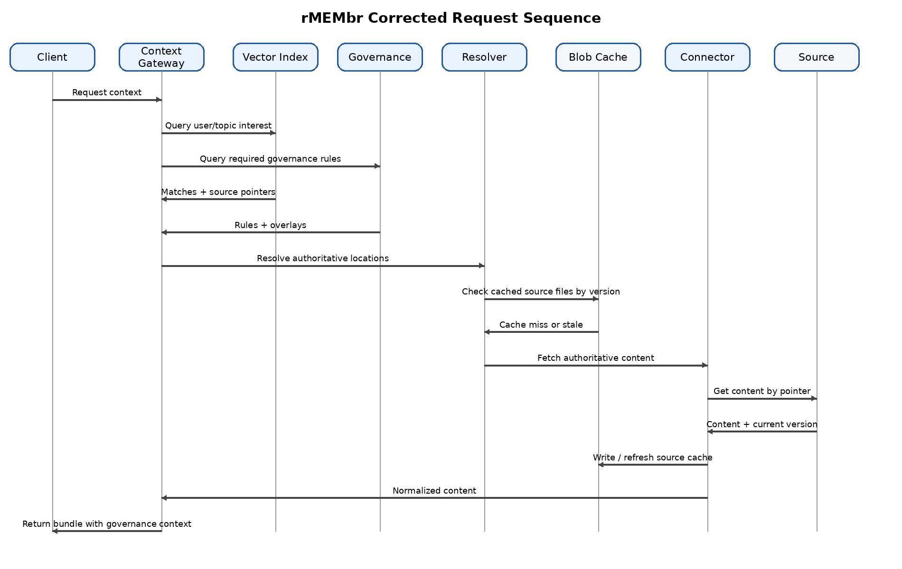
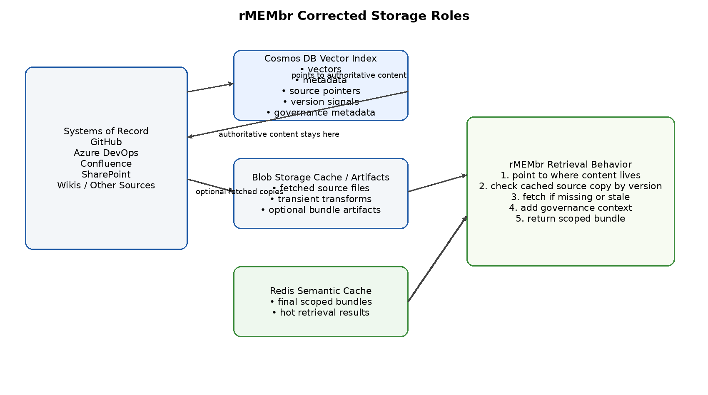
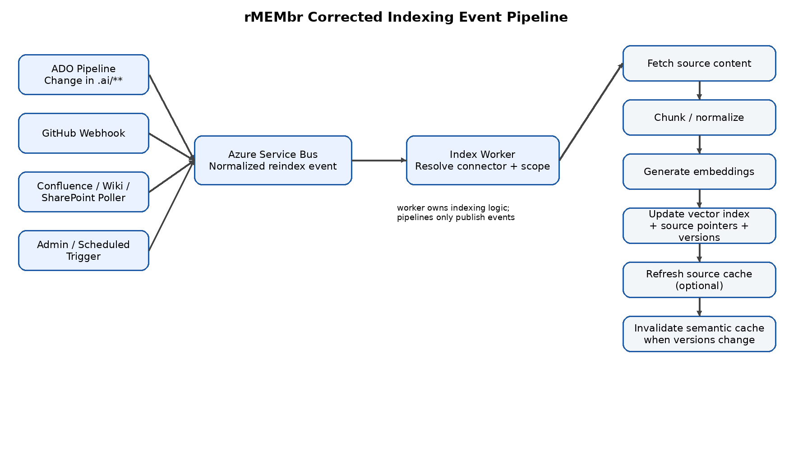

# rMEMbr Corrected Static Diagram Pack

These corrected diagrams align to the intended behavior:

- Client calls the **MCP server / Context Gateway**
- Gateway queries the **vector index** for the user's interest
- Gateway separately queries **governance / standards**
- Gateway resolves where authoritative content should live
- Gateway checks **Blob cache** using source version signals
- If cache is missing or stale, it fetches directly from the source and refreshes cache
- Gateway assembles the final scoped bundle and writes the semantic cache

## Corrected Overall Architecture

## Corrected Request Sequence

## Corrected Storage Roles

## Corrected Indexing Pipeline

